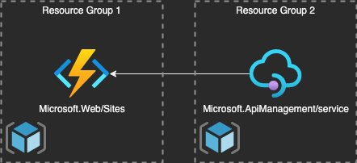

# Bonus Opdracht
Als je hier bent aangekomen, ten eerste gefeliciteerd. Je hebt alle opdrachten afgerond.

Nu je de basis van bicep beheerst. Word het tijd voor wat meer uitdaging. Na opdracht 3 ben je, als het goed is bekend met scopes. Hier gaan we scopes in een wat andere context gebruiken.

Hieronder de omgeving die je moet gaan bouwen.  
LET OP: Deze opdracht valt alleen te maken in een eigen subscription, je zult hier meerdere resource groups voor nodig hebben.



Requirements:
- Azure function:
    - Consumption plan

- API Management:
    - Consumption Plan

als je klaar bent kan je het worksheet deployen naar je resourcegroup via het volgende commando:
```azurecli
az deployment group create --resource-group {{Jouw resourcegroup}} --name bonus --template-file worksheet.bicep   
```